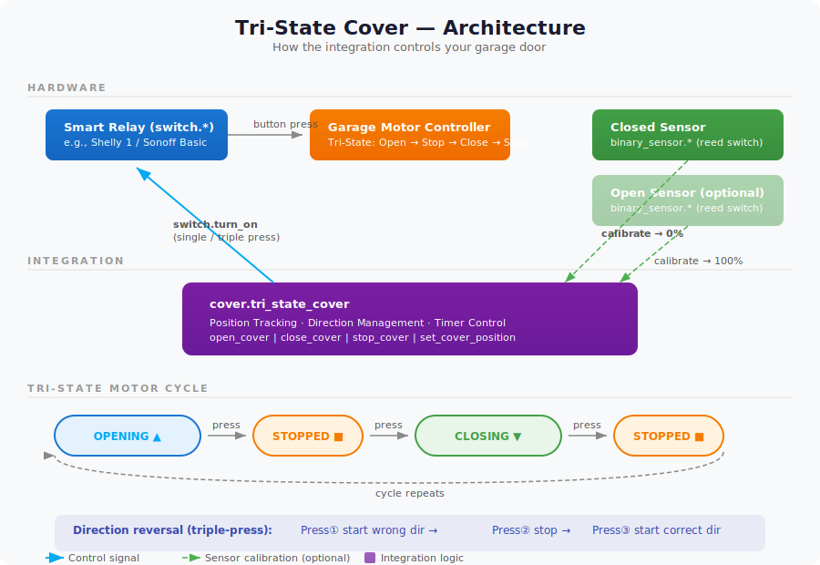

# Tri-State Cover

[](https://github.com/hacs/integration)

A Home Assistant integration for garage doors and covers controlled by a **tri-state motor** — a single button that cycles through **Open → Stop → Close → Stop**.

## The Problem

Many garage door openers, gate motors, and rolling shutters use a simple tri-state control: one button press cycles the motor direction. There's no native position feedback — just a toggle switch.

Home Assistant's built-in cover template requires manual scripting with helpers, timers, and automations to track position and handle direction reversal. This integration packages all of that into a clean, configurable component.

## Features

- **Position tracking** — Estimates position (0–100%) based on travel time
- **Partial positioning** — Set any position via `set_cover_position` (e.g., open to 25%)
- **Tri-state direction handling** — Automatically manages the Open→Stop→Close→Stop cycle, including triple-press for direction reversal
- **Endstop sensor calibration** — Optional binary sensors for closed/open detection auto-calibrate position
- **State restoration** — Position and direction survive HA restarts
- **Configurable toggle delay** — Adjust timing between rapid presses for your motor

## Prerequisites

### Minimum Required

| Component | Example | Purpose |
|-----------|---------|---------|
| **Smart relay/switch** | Shelly 1, Sonoff Basic, Shelly Plus 1 | Controls the motor — appears as `switch.*` in HA |
| **Door/gate contact sensor** | Aqara Door Sensor, Shelly Door/Window | Detects fully closed position — appears as `binary_sensor.*` in HA |

The switch must be wired to the garage motor's button input (the same terminal your wall button connects to). Each `switch.turn_on` call simulates a button press.

### Recommended (for better accuracy)

| Component | Example | Purpose |
|-----------|---------|---------|
| **Open-position sensor** | Reed switch at top of travel | Detects fully open position — eliminates drift over time |

### Wiring Diagram

```
                    ┌─────────────┐
Wall Button ────────┤             │
                    │  Garage     ├──── Motor
Smart Relay ────────┤  Motor      │
(Shelly 1)  ────────┤  Controller │
                    └─────────────┘

Door Sensor (magnetic) ──── mounted at closed position
Open Sensor (optional) ──── mounted at open position
```

> **Tip:** Measure the full travel time (fully open → fully closed) with a stopwatch. Precision here directly affects position accuracy.

## Architecture



## Installation

### HACS (recommended)

1. Open HACS → Integrations → **Custom Repositories**
2. Add `https://github.com/Grrzzz/ha-tri-state-cover` as an Integration
3. Install **Tri-State Cover**
4. Restart Home Assistant

### Manual

1. Copy `custom_components/tri_state_cover/` to your `config/custom_components/` directory
2. Restart Home Assistant

## Configuration

1. Go to **Settings → Devices & Services → Add Integration**
2. Search for **Tri-State Cover**
3. Configure:

| Parameter | Required | Description |
|-----------|----------|-------------|
| Toggle switch | Yes | The `switch.*` entity that controls the motor |
| Full travel time | Yes | Time (seconds) for full open↔closed travel (default: 20s) |
| Closed sensor | No | `binary_sensor